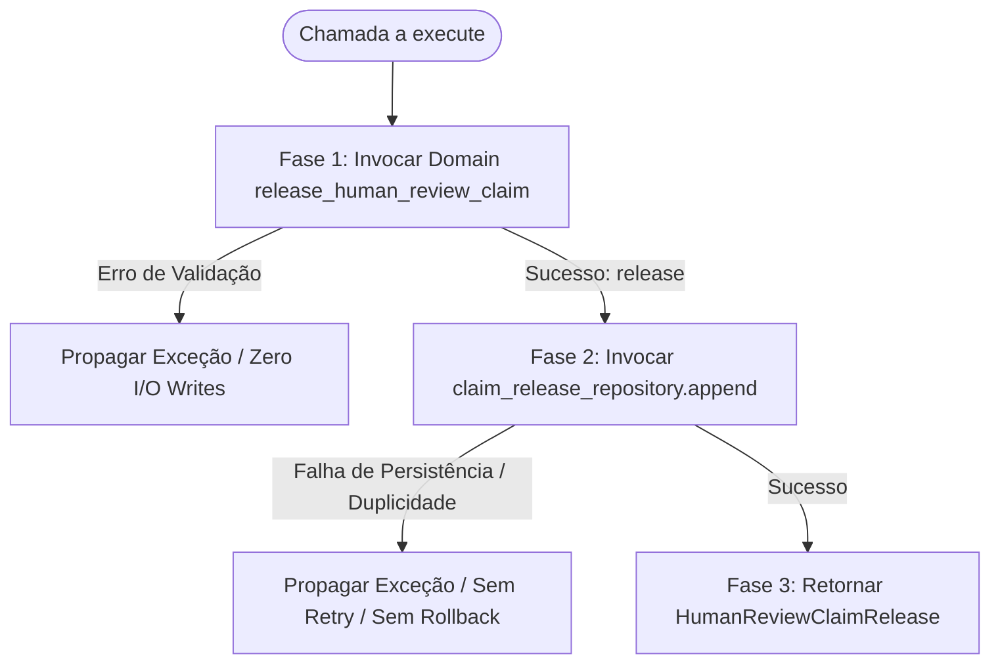

# SPEC-0112 — Release Human Review Claim Application Use Case v1

> Especificação técnica da camada de Application para coordenação da liberação voluntária
> de reivindicações de revisão humana (`ReleaseHumanReviewClaimUseCase`) no Agent Lab Pascoal.

---

## Metadados

| Campo | Valor |
|---|---|
| **Identificador** | `SPEC-0112` |
| **Status** | `APPROVED` |
| **Issue relacionada** | `#112` |
| **Título da Issue** | `Release Human Review Claim Application Use Case v1` |
| **Branch funcional** | `feature/issue-112-release-human-review-claim-use-case` |
| **Responsável** | `Jk-Pascoal` |
| **Data de criação** | `2026-09-09` |
| **Última atualização** | `2026-09-09` |
| **Baseline de entrada** | `646 testes aprovados` (100% GREEN) |
| **Runner oficial** | `python -m unittest discover -s tests -v` (Python 3.11.9) |

---

## 1. Contexto

O **Agent Lab Pascoal** consolida uma esteira de governança assistida de cadastros industriais PDM/BOM orientada pelo princípio:

```text
Repository preserva → Projection interpreta → Policy governa → Application coordena e aplica
```

No baseline de entrada da SPEC-0112, a branch `main` conta com **646 testes aprovados** (Python 3.11.9 / `unittest`).
A evolução das trilhas operacionais de assunção e liberação de revisão humana é descrita pelos seguintes marcos integrados:

### Trilha de Human Review Claim
* **Issue #85**: Human Review Claim Domain Contract (entidade imutável `HumanReviewClaim` e fábrica pura `claim_pending_human_review`);
* **Issue #88**: Human Review Claim Persistence (`HumanReviewClaimRepository` e `JsonlHumanReviewClaimRepository`);
* **Issue #91**: Record Human Review Claim Application Use Case (`RecordHumanReviewClaimUseCase`);
* **Issue #94**: Human Review Claim State Projection (`project_human_review_claim_state`);
* **Issue #97**: Pending Queue + Claim State Application (`ListPendingHumanReviewsWithClaimStateUseCase`);
* **Issue #100**: Reviewer Claim Eligibility Policy (`evaluate_reviewer_claim_eligibility`);
* **Issue #103**: Runtime Enforcement (`evaluate_reviewer_claim_eligibility` aplicado à esteira).

### Trilha de Human Review Claim Release
* **Issue #106**: Human Review Claim Release Domain Contract (entidade imutável `HumanReviewClaimRelease` e operação pura `release_human_review_claim`);
* **Issue #109**: Human Review Claim Release Persistence (`HumanReviewClaimReleaseRepository` e `JsonlHumanReviewClaimReleaseRepository`);
* **Issue #112**: Application Use Case atual (`ReleaseHumanReviewClaimUseCase`).

---

## 2. Problema, Justificativa e Impacto

### 2.1 Problema
Atualmente, o domínio possui a regra pura de negócio capaz de validar e instanciar o release:

```text
release_human_review_claim(workflow, claim, ...) → HumanReviewClaimRelease
```

E a persistência já consegue armazená-lo duravelmente:

```text
HumanReviewClaimReleaseRepository.append(release)
```

No entanto, **não existe um boundary oficial na camada de Application** que coordene essas duas capacidades. Sem esse boundary, qualquer consumidor externo (seja uma UI, API REST, comando CLI, worker assíncrono ou script de orquestração) é forçado a:
1. Conhecer a função pura de domínio e importar suas dependências;
2. Conhecer a interface do repositório de persistência de releases;
3. Orquestrar manualmente a sequência de chamada (domínio seguido de append);
4. Tratar ou propagar de forma dispersa falhas ocorridas em cada etapa.

### 2.2 Justificativa e Solução
A introdução do caso de uso `ReleaseHumanReviewClaimUseCase` encapsula e padroniza o ponto de entrada da operação de release na camada de Application, mantendo a simetria com `RecordHumanReviewClaimUseCase` (Issue #91) e isolando clientes externos dos detalhes de coordenação sequencial entre Domain e Repository.

---

## 3. Tese Arquitetural

A arquitetura do Agent Lab Pascoal estabelece a separação estrita de papéis:

```text
Application coordena.
Domain decide.
Repository preserva.
Projection interpreta.
Policy governa.
```

E de forma basilar:

```text
Application coordination != transaction
```

A execução do caso de uso é estritamente **sequencial e linear**, estruturada em três fases bem delimitadas:

```text
Fase 1 — Domain / zero I/O
release_human_review_claim(...)

Fase 2 — Persistence
claim_release_repository.append(release)

Fase 3 — Return
return release
```

### Inexistência de Semântica Transacional
Não existe e não é introduzido:
* Transação ACID;
* Rollback automático;
* Retry automático;
* Mecanismos de compensação ou sagas;
* Two-Phase Commit (2PC);
* Unidade transacional compartilhada entre memória e disco.

Se a validação de domínio falhar na Fase 1, nenhuma operação de I/O ocorre (**zero writes**). Se a persistência falhar na Fase 2, a exceção é propagada diretamente ao chamador de forma *fail-closed*, sem mascaramento e sem reversão do objeto que existiu transitoriamente na memória.

---

## 4. Contrato Proposto

### 4.1 Módulo Canônico
O caso de uso será hospedado em módulo dedicado na camada de aplicação:

```text
src/agent_lab/human_review_claim_release_use_case.py
```

*Justificativa do isolamento*: Mantém simetria com `src/agent_lab/human_review_claim_use_case.py` (onde reside `RecordHumanReviewClaimUseCase`), respeitando o princípio de responsabilidade única e evitando o acoplamento excessivo em um único arquivo de casos de uso de claims.

### 4.2 Definição de Tipos e Assinatura Pública

```python
class ReleaseHumanReviewClaimUseCase:
    """Application use case to coordinate releasing a human review claim."""

    def __init__(
        self,
        *,
        claim_release_repository: HumanReviewClaimReleaseRepository,
    ) -> None:
        ...

    def execute(
        self,
        workflow: GovernanceWorkflow,
        claim: HumanReviewClaim,
        *,
        release_id: str,
        releasing_specialist: VerifiedSpecialistIdentity,
        released_at: datetime,
    ) -> HumanReviewClaimRelease:
        ...
```

---

## 5. Responsabilidades da Application

A camada de Application deve estritamente:

1. **Injeção de dependência explícita:** Receber obrigatoriamente uma instância aderente ao protocolo `HumanReviewClaimReleaseRepository` em seu inicializador;
2. **Validação defensiva de boundary:** Validar tipos estruturais preliminares na entrada de `execute` (`workflow: GovernanceWorkflow`, `claim: HumanReviewClaim`), rejeitando argumentos inconsistentes com `TypeError`;
3. **Delegação integral ao Domain:** Invocar `release_human_review_claim(workflow=workflow, claim=claim, release_id=release_id, releasing_specialist=releasing_specialist, released_at=released_at)` sem duplicar regras de negócio;
4. **Persistência sequencial:** Ao receber o fato válido `HumanReviewClaimRelease`, invocar exatamente uma vez `self._claim_release_repository.append(release)`;
5. **Retorno do fato:** Retornar a mesma instância de `HumanReviewClaimRelease` persistida.

### Ações Proibidas na Application
A Application **NÃO deve**:
* Comparar Stable Principal diretamente (`specialist_id`, `identity_provider`, `identity_subject`);
* Comparar timestamps (`released_at >= claim.claimed_at` ou `verified_at <= released_at`);
* Verificar se `released_at` é timezone-aware;
* Avaliar manualmente `workflow.status` ou o estado derivado de `workflow.review`;
* Validar igualdade entre `workflow.workflow_id` e `claim.workflow_id`;
* Consultar histórico de releases anteriores no repositório;
* Avaliar se a claim está "ativa", "cancelada" ou "vigente";
* Impedir ou deduplicar releases que referenciem o mesmo `claim_id`.

---

## 6. Autoridade Exclusiva do Domain

A função pura de domínio `release_human_review_claim(...)` (estabelecida na Issue #106) permanece a **única e exclusiva autoridade** para validação das regras de negócio e integridade lógica:

* Validação estrita de instâncias: `GovernanceWorkflow`, `HumanReviewClaim`, `VerifiedSpecialistIdentity`;
* Coerência referencial de workflow: `workflow.workflow_id == claim.workflow_id`;
* Status de governança do workflow: validação explícita de que `workflow.status is WorkflowStatus.PENDING_HUMAN_REVIEW` (no modelo atual de `GovernanceWorkflow`, esse status implica `workflow.review is None` porque `status` é propriedade derivada do campo `review`; nenhuma validação redundante é executada ou adicionada em produção);
* Validação temporal: `released_at` obrigatoriamente timezone-aware, isto é:
  * `released_at.tzinfo is not None`;
  * `released_at.utcoffset() is not None`;
  *(sem exigir timezone UTC específico nem offset zero)*;
* Monotonicidade temporal do evento: `released_at >= claim.claimed_at`;
* Identidade estável (*Stable Principal*) estrita:
  * `releasing_specialist.specialist_id == claim.specialist.specialist_id`
  * `releasing_specialist.identity_provider == claim.specialist.identity_provider`
  * `releasing_specialist.identity_subject == claim.specialist.identity_subject`
* Isolamento de credenciais efêmeras: divergências em `verification_id` ou `verified_at` não invalidam o release se o Stable Principal for idêntico;
* Precedência de verificação do liberador: `releasing_specialist.verified_at <= released_at`;
* Preservação da imutabilidade intrínseca de `workflow` e `claim`.

A Application não intercepta, não recalcula e não atenua nenhuma dessas regras.

---

## 7. Autoridade Exclusiva do Repository

O protocolo `HumanReviewClaimReleaseRepository` (e sua implementação `JsonlHumanReviewClaimReleaseRepository`, consolidados na Issue #109) permanece a **única autoridade para preservação física dos dados**:

* Trilha física isolada append-only em arquivo dedicado;
* Unicidade estrita exclusivamente por `release_id` (`DuplicateHumanReviewClaimReleaseError`);
* Tolerância a múltiplos releases distintos apontando para o mesmo `claim_id`;
* Preservação da ordem física sequencial de inserção;
* Integridade fail-closed contra linhas vazias, JSON malformado ou violações de schema (`HumanReviewClaimReleaseCorruptionError`);
* Durabilidade através de `flush` e `fsync`.

O caso de uso de aplicação não deve tentar contornar, reinterpretar ou alterar a semântica do repositório.

---

## 8. Invariantes Constitucionais

A implementação da SPEC-0112 deve respeitar formalmente as seguintes 14 invariantes constitucionais:

1. **`HumanReviewClaimRelease != HumanReviewClaim`**: Release é a liberação explícita de uma reivindicação anterior; não substitui nem altera a ontologia da claim original.
2. **`RELEASED CLAIM != REVIEWED WORKFLOW`**: Registrar um release representa exclusivamente o fato histórico de liberação voluntária da claim; não conclui o workflow e não determina, nesta camada, disponibilidade, vigência ou autoridade operacional (preservando integralmente o princípio de que *release factual != active claim semantics*).
3. **`release factual != active claim`**: A gravação de um release registra um fato histórico; não introduz o conceito de "claim ativa" ou "inativa" nesta camada.
4. **`release factual != Active Claim Projection`**: Fatos de release são apenas preservados; sua projeção agregada pertence a camada analítica futura.
5. **`release factual != Active Claim Policy`**: Nenhuma decisão normativa ou política de governança de claims é inferida ou imposta pelo caso de uso.
6. **`Repository != Projection`**: O repositório preserva a história bruta append-only; ele não calcula estado consolidado.
7. **`Application != Domain`**: Application coordena a sequência; Domain valida regras de negócio e emite a entidade.
8. **`Application coordination != transaction`**: A coordenação é sequencial sem semântica transacional, rollback ou compensação.
9. **`WorkflowStatus` permanece inalterado**: A execução do release não altera o status do workflow (permanece `WorkflowStatus.PENDING_HUMAN_REVIEW`).
10. **Release não conclui workflow**: Nenhum campo de fechamento ou revisão é atribuído ao workflow.
11. **Release não gera `HumanReview`**: Nenhuma decisão de conformidade técnica é produzida.
12. **Release não gera `AuditEvent`**: Nenhuma gravação em `AuditRepository` é realizada por este caso de uso.
13. **Release não gera `WorkflowLifecycleEvent`**: A trilha de eventos do ciclo de vida do workflow permanece intocada.
14. **Múltiplos releases para o mesmo `claim_id` permanecem permitidos**: Se chamadores emitirem releases distintos (com `release_id`s diferentes) para o mesmo `claim_id`, o caso de uso e o repositório devem aceitá-los como fatos históricos válidos.

---

## 9. Semântica de Falhas e Comportamento Fail-Closed



### 9.1 Falha Antes da Persistência (Fase 1 — Domínio)
Se a validação estrutural de entrada ou a função pura `release_human_review_claim(...)` levantar uma exceção (`TypeError`, `ValueError`):
* O método `claim_release_repository.append(...)` **não é invocado**;
* Há garantia de **zero writes** no meio persistente;
* A exceção original é imediatamente propagada ao chamador sem mascaramento.

### 9.2 Falha Durante a Persistência (Fase 2 — Repositório)
Se a invocação de `claim_release_repository.append(...)` falhar (ex.: `DuplicateHumanReviewClaimReleaseError`, `HumanReviewClaimReleasePersistenceError`, `OSError`):
* A exceção original é imediatamente propagada ao chamador;
* Nenhum retry automático é tentado;
* Nenhuma operação de compensação ou rollback simulado é executada;
* A chamada é abortada sem retornar sucesso ou o objeto em memória.

---

## 10. Planejamento de Testes por Micro-TDD

O desenvolvimento funcional da SPEC-0112 será conduzido estritamente pelo ciclo Red-Green-Refactor, dividido nas 7 fatias planejadas a seguir:

### Fatia 1 — Application Boundary & Caminho Feliz
* Utilizar `FakeHumanReviewClaimReleaseRepository` em memória;
* Fornecer workflow válido (`PENDING_HUMAN_REVIEW`), claim válida e credenciais correspondentes;
* Verificar que exatamente uma chamada a `append(release)` é realizada no repositório;
* Verificar que o argumento repassado ao repositório é idêntico ao release produzido;
* Verificar que o caso de uso retorna a mesma instância de `HumanReviewClaimRelease`.

### Fatia 2 — Validações Determinísticas e Garantia de Zero Writes
* Rejeitar workflow inválido (tipo não `GovernanceWorkflow`);
* Rejeitar claim inválida (tipo não `HumanReviewClaim`);
* Rejeitar workflow com status diferente de `PENDING_HUMAN_REVIEW`;
* Rejeitar divergência de `workflow_id` entre workflow e claim;
* Rejeitar releasing specialist cujo Stable Principal não corresponda ao claimant original;
* Rejeitar `released_at` naive (sem timezone);
* Rejeitar `released_at < claim.claimed_at`;
* Em todos os cenários, assegurar que **zero writes** ocorrem no repositório (`append` nunca chamado).

### Fatia 3 — Tratamento Fail-Closed de Falhas de Persistência
* Simular repositório que lança `DuplicateHumanReviewClaimReleaseError`;
* Simular repositório que lança `HumanReviewClaimReleasePersistenceError` genérico;
* Assegurar propagação transparente da exceção exata, sem captura silenciosa, sem retry e sem mascaramento.

### Fatia 4 — Semântica de Múltiplos Releases para o Mesmo `claim_id`
* Registrar sequencialmente `REL-001` para `CLM-001` e `REL-002` para `CLM-001`;
* Assegurar que ambos os releases são aceitos e persistidos no repositório em suas respectivas chamadas;
* Confirmar que o caso de uso não impõe regras artificiais de exclusividade histórica por `claim_id`.

### Fatia 5 — Imutabilidade e Ausência de Efeitos Colaterais
* Verificar via testes unitários que os campos de `workflow` não sofrem mutação após o release (`status` permanece `PENDING_HUMAN_REVIEW`, `review` permanece `None`);
* Verificar via testes unitários que a instância de `claim` original permanece intacta e imutável;
* Não criar testes artificiais ou mocks de `AuditRepository` ou `WorkflowLifecycleRepository`, pois essas dependências não pertencem ao contrato do novo caso de uso;
* Estabelecer que a auditoria humana de diff/implementação deve confirmar:
  * Ausência total de imports ou acoplamentos com `AuditRepository` ou tipos de auditoria;
  * Ausência total de imports ou acoplamentos com `WorkflowLifecycleRepository` ou eventos de ciclo de vida;
  * `workflow` e `claim` estritamente imutáveis.

### Fatia 6 — Integração Vertical com Persistência JSONL
* Instanciar `ReleaseHumanReviewClaimUseCase` integrado com `JsonlHumanReviewClaimReleaseRepository` apontando para arquivo temporário;
* Executar o caso de uso de liberação de claim;
* Fechar os handles e instanciar uma **nova instância independente** do repositório JSONL sobre o mesmo arquivo;
* Garantir recuperação fiel do release persistido pós-restart lógico do repositório.

### Fatia 7 — Exportação no Pacote Público e Proteção contra Regressão
* Exportar `ReleaseHumanReviewClaimUseCase` em `agent_lab/__init__.py` e declarar em `__all__`;
* Executar a suíte de testes integral do Agent Lab Pascoal;
* Garantir que os 646 testes do baseline permanecem 100% GREEN junto aos novos testes da Issue #112.

---

## 11. Limites Estritos e Fora de Escopo

Fica expressamente **PROIBIDO** implementar ou introduzir no escopo da Issue #112:

* Uso de `HumanReviewClaimRepository` como mecanismo de consulta histórica ou validação de existência;
* Projeção de reivindicação ativa (*Active Claim Projection*);
* Política de reivindicação ativa (*Active Claim Policy*);
* Determinação ou cálculo de vigência ou expiração de claims;
* Semântica de exclusividade, *owner*, *winner*, *assignment* ou distribuição de filas;
* Heurísticas de resolução de concorrência (*First-Claim-Wins*, *Last-Claim-Wins*);
* Mecanismos de locking distribuído, checkout, exclusão mútua (mutex) ou travas de arquivo;
* Controle de lease temporal, TTL, heartbeat ou expiração automática de releases/claims;
* Mecanismos administrativos de liberação forçada (*force-release*) ou transferência de claims;
* Regra de "claim só pode ter um único release" ou deduplicação pelo `claim_id`;
* Verificação histórica no repositório para conferir se a claim já foi liberada anteriormente;
* Qualquer alteração no valor ou semântica de `WorkflowStatus`;
* Emissão de registros de auditoria (`AuditEvent`) ou eventos de ciclo de vida (`WorkflowLifecycleEvent`);
* Alterações em `RecordHumanDecisionUseCase`, `RecordHumanReviewClaimUseCase` ou na `ReviewerEligibilityPolicy`;
* Interfaces gráficas (UI), endpoints REST ou comandos CLI;
* Suporte a chamadas assíncronas (`async`/`await`) ou coordenação multiprocesso;
* Transações ACID, rollback distribuído, 2PC ou lógica de compensação automática.

---

## 12. Questão Arquitetural Explicitamente Adiada

> **Aviso de Limite Conceitual:**
> O fato de existir um registro de `HumanReviewClaimRelease` persistido para um determinado `HumanReviewClaim` **NÃO autoriza** esta camada de Application a declarar ou assumir que o referido claim está atualmente "inativo", "revogado" ou "inexistente".

A interpretação sobre o estado operacional consolidado de uma reivindicação depende do cruzamento contextual entre múltiplos fluxos de eventos históricos:

```text
Fatos de Assunção (HumanReviewClaim)
          +
Fatos de Liberação (HumanReviewClaimRelease)
          ↓
[ Active Claim Projection ] → Estado Analítico da Fila
```

Essa responsabilidade analítica pertence exclusivamente a uma futura **Active Claim Projection**, a ser especificada e implementada em sua própria Issue dedicada.

---

## 13. Critérios de Aceitação e Definition of Done

A entrega da Issue #112 será considerada concluída somente quando todos os seguintes critérios forem atendidos:

1. [ ] **SPEC Aprovada**: `SPEC-0112` formalmente aprovada pela revisão humana antes do início da implementação;
2. [ ] **Isolamento de Branch**: Todo o trabalho desenvolvido exclusivamente na branch `feature/issue-112-release-human-review-claim-use-case`;
3. [ ] **Micro-TDD**: Desenvolvimento orientado a testes respeitando rigorosamente as 7 fatias planejadas;
4. [ ] **Casos de Uso e Persistência**: Implementação canônica de `ReleaseHumanReviewClaimUseCase` no módulo `src/agent_lab/human_review_claim_release_use_case.py`;
5. [ ] **Integração Real**: Testes de integração vertical comprovando persistência e reconstituição fiel via `JsonlHumanReviewClaimReleaseRepository`;
6. [ ] **Preservação de Baseline**: Suíte de testes completa executando 100% GREEN (baseline de 646 testes preservado integralmente, acrescido dos novos testes);
7. [ ] **Higiene Git**: `git diff --check` executando com sucesso e sem violações de whitespace;
8. [ ] **Auditoria Pré-PR**: Auditoria humana confirmando ausência de acoplamento indevido ou desvios de escopo (*scope creep*);
9. [ ] **Pull Request Funcional**: PR aberto contra `main` e aprovado em CI;
10. [ ] **Closeout Documental Separado**: Atualização de status da SPEC para `IMPLEMENTED`, atualização de `PROJECT_COMPASS` e realização de `README Audit` obrigatório (alterando o README somente se o audit indicar `UPDATE REQUIRED`) em PR documental próprio pós-merge funcional.
